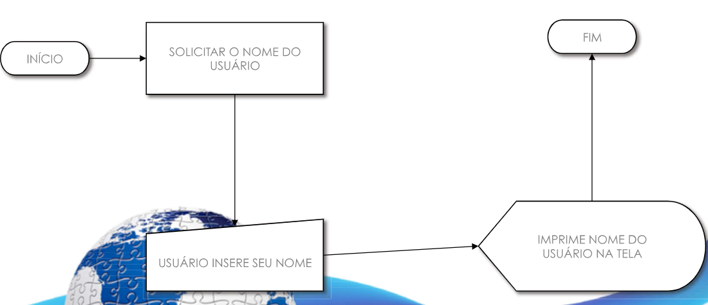
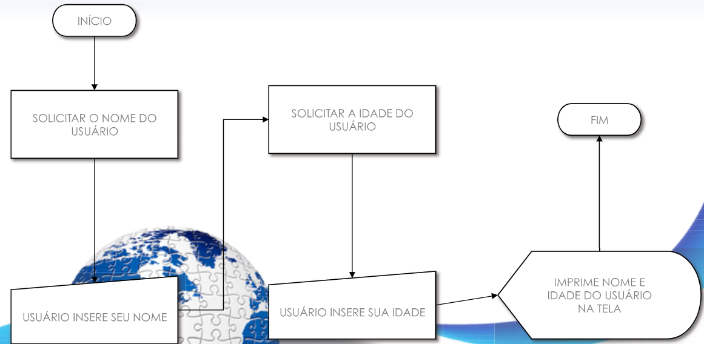
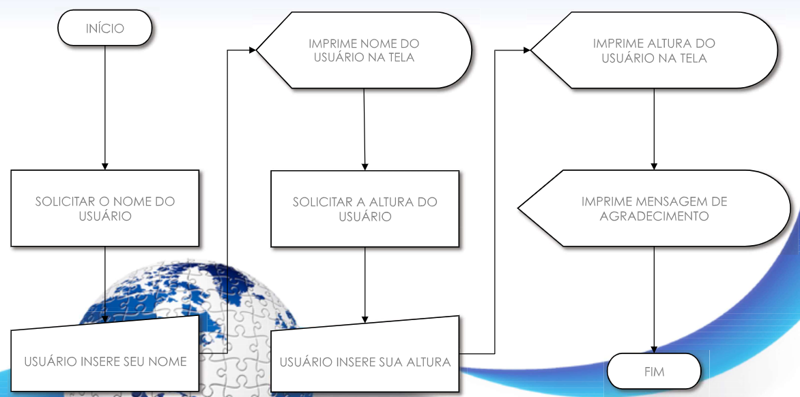

# atividades
## atividade 01
Programe o código para o fluxograma abaixo:

## atividade 02
Programe o código para o fluxograma abaixo:

## atividade 03
Programe o código para o fluxograma abaixo:

## atividade 04
Crie um programa que solicita informoções completas do endereço do usuário (como nome da rua, cep, bairro etc.). Depois disto, seu programa deve imprimir na tela as informações do endereço do usuário de forma clara e organizada.

## atividade 05
Crie um programa que pede 5 números inteiros pelo teclado e imprime as seguintes informações:
- A soma de todos os números
- O produto de todos os números

## atividade 06
Crie um programa que pede 5 números inteiros pelo teclado e armazena-os, respectivamente, nas variáveis A, B, C, D e E. Em seguida faça o que se pede:
- Sabendo que B e C são respectivamente a base e a altura de um triângulo, imprima a área deste triângulo
- Sabendo que A, B, C e D formam um retângulo, imprima o perímetro deste retângulo
- Sabendo que E é o valor do raio de um determinado círculo, imprima a área deste círculo

## atividade 07
Uma determinada disciplina possui apenas 3 avaliações:
- o trabalho (10% da nota)
- a prova (60% da nota)
- o teste (30% da nota)
Crie um programa que pede para o usuário digitar as notas que ele tirou nestas avaliações e imprime na tela a nota final do aluno.

## atividade 08
Uma disciplina possui Grau A e Grau B. A nota do Grau A vale 33% da nota final, enquanto a nota do Grau B vale 67% da nota final.

O Grau A possui as seguintes avaliações:
- Atividade prática (45% da nota do Grau A)
- Atividade teórica (55% da nota do Grau A)

Já o grau B possui as seguintes avaliações:
- Prova em laboratório (60% da nota do Grau B)
- Teste teórico (20% da nota do Grau B)
- Trabalho extraclasse (20% da nota do Grau B)

Crie um programa que solicite as notas de todas as avaliações e imprime na tela a nota final obtida na disciplina.

# atividades avançadas
## atividade avançada 01
Faça um programa em Python que:
- Receba um float digitado pelo usuário e armazena em A
- Receba um inteiro digitado pelo usuário e armazene em B
- Imprima o resultado na tela

## atividade avançada 02
Faça um programa em Python que:
- Uma equação do segundo grau possui o seguinte formato: ax^2 + bx + c = 0
- Para resolver esta equação, devemos encontrar as duas raízes, x’ e x’’.
- Assim sendo, crie um programa em Python que recebe os valores inteiros a, b e c e retorna as duas raízes da equação de segundo grau orrespondente. 
