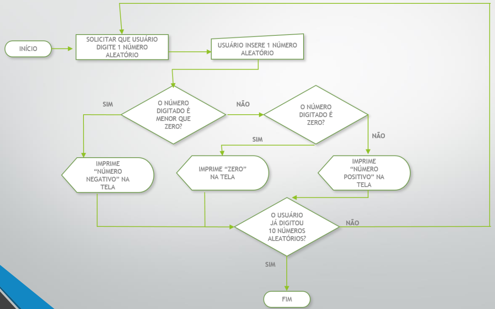

# atividades sobre while - lista 02
## atividade 01
Faça o código que implementa o algoritmo descrito no fluxograma abaixo:

## atividade 02
Faça um programa que escreva na tela todos os números inteiros entre 0 (inclusive) e 1000 (inclusive).

## atividade 03
Faça um programa que escreva na tela todos os valores inteiros que estão entre dois valores digitados pelo usuário (num1 e num2). Caso num1 seja maior do que num2, imprima uma mensagem de erro e não imprima.

## atividade 04
Faça um programa que escreva na tela todos os valores inteiros entre dois valores digitados pelo usuário (num1 e num2). Caso num1 seja maior do que num2, seu programa deve imprimir os valores entre num1 e num2 da mesma forma.

## atividade 05
Faça um programa que imprima na tela a soma de todos os valores entre 1 e 1000.

## atividade 06
Faça um programa que solicita ao usuário que ele digite números que sejam positivos e pares. Quando o usuário digitar um número que não seja o solicitado, imprima na tela a soma dos valores positivos e pares digitados.

## atividade 07
O usuário e a senha de um cliente são, respectivamente, **USER10** e **PASSWORD1234**. Sabendo disso, faça um programa que solicita ao usuário que ele digite seu usuário e senha. O programa só termina quando ele acertar o usuário e a senha. Quando ele acertar, você deve informar a mensagem: **LOGIN EFETUADO COM SUCESSO**.

## atividade 08
O usuário e a senha de um cliente são, respectivamente, **USER10** e **PASSWORD1234**. Sabendo disso, faça um programa que solicita ao usuário que ele digite seu usuário e senha. O programa termina quando ele acertar o usuário e a senha ou quando ele exceder o máximo de 3 tentativas. Quando ele acertar, o programa deve informar a mensagem: **LOGIN EFETUADO COM SUCESSO**. Caso ele exceda a quantidade de tentativas, o programa deve informar a mensagem: **NÚMERO MÁXIMO DE TENTATIVAS EXCEDIDO!**